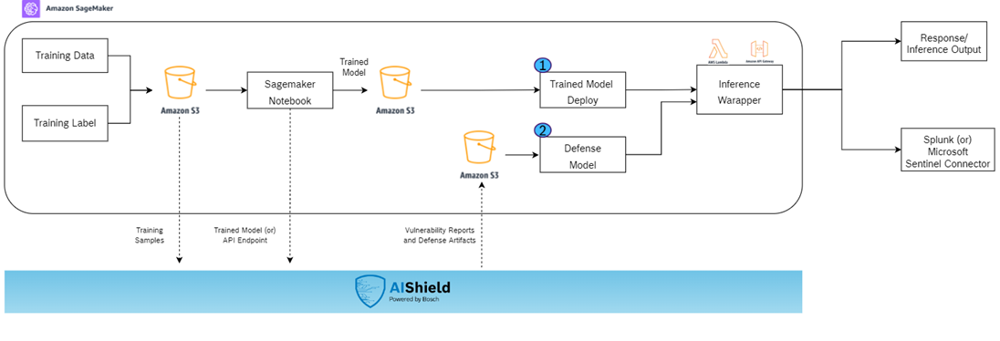
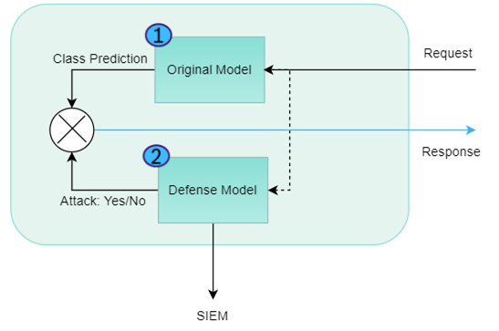
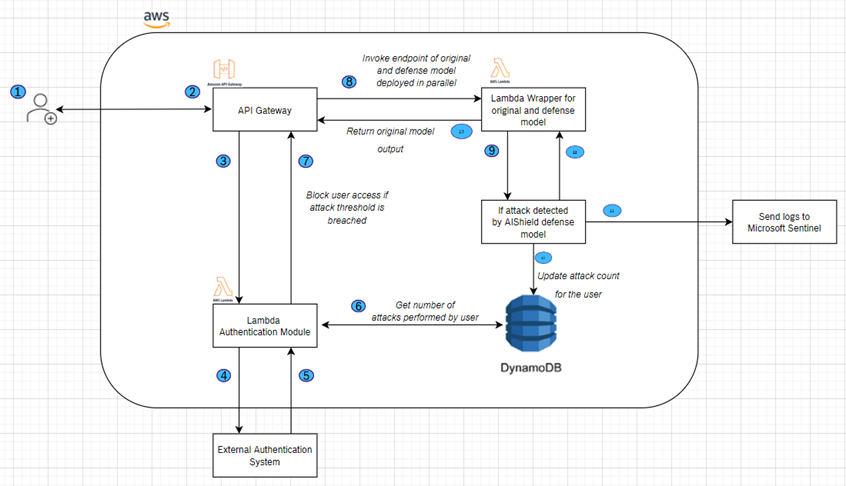

Requirements :

1. AWS Subscription - for using SageMaker and its associated services
2. AIShield subscription details - URL and subscription key for for making call to image classification service for vulnerability analysis
3. Reference notebook and its requirements file (for required library installation) is present inside Extraction and Evasion folder. The referencre implementation covers training of a model and then steps to get the defense model using AIShield API.
4. 'AWS Deployment Artifacts' folder contains the script and reference notbooks to help in deploying the models in sagemaker. It also contains necessary lambda function example to block a malicious user at the system level.

    

    

    

