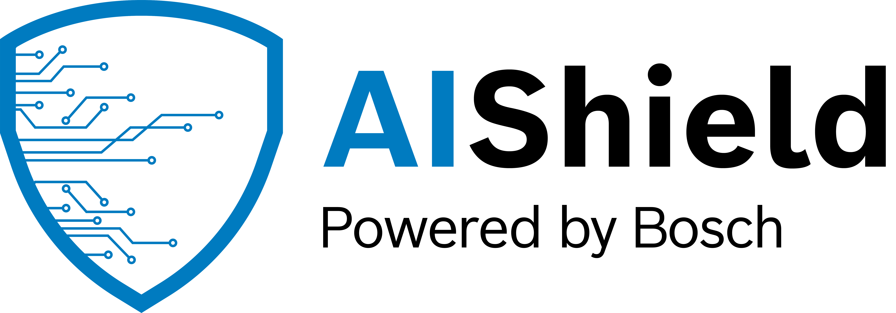

<a name="getting-started"></a>

<div align="left">
    
</div>

# Getting Started

This repo contains reference implementations, tutorials, samples, and documentation for working with Bosch AIShield
   
<a name="license"></a>
# License

```
See LICENSE File for details. 
```

<a name="i-want-to-know-more"></a>
# I want to know more!

Please reach us at aishield.contact@bosch.com


<a name="want-to-contribute"></a>
# Want to Contribute?

This is an open source project, and we'd love to see your contributions!
Please git clone this project and send us a pull request. Thanks.


   
   

